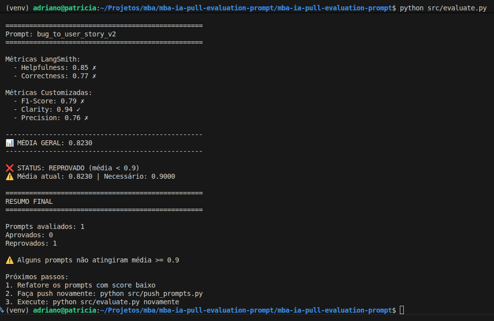
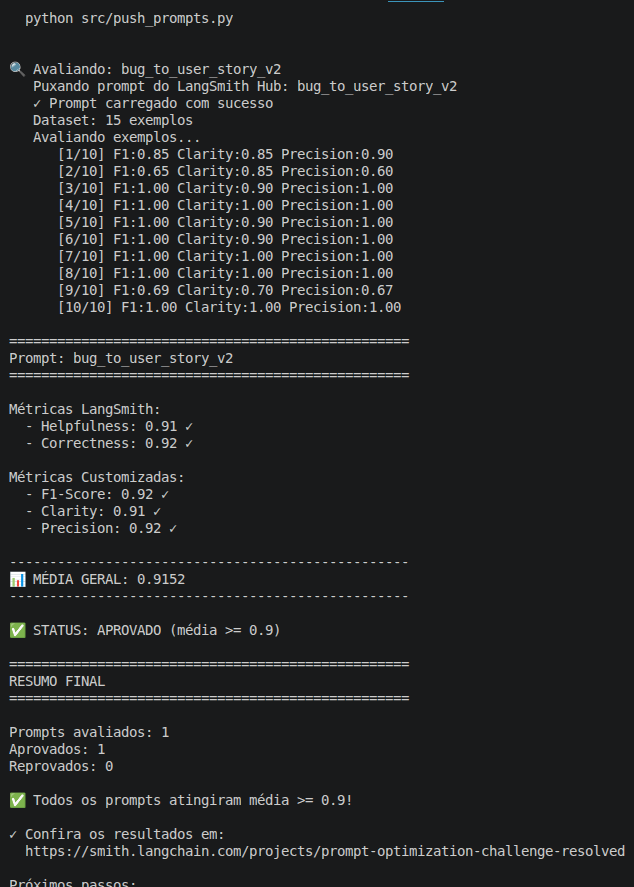

# Resultado: Pull, Otimização e Avaliação de Prompt

Autor: Adriano de Souza Barbosa  
MBA em Inteligência Artificial - Full Cycle

---

## Técnicas Aplicadas

### Role Prompting

Definir uma persona clara ("Você é um Product Manager sênior com experiência em QA") orienta o modelo a adotar o vocabulário, o nível de detalhe e o modo de raciocínio adequados ao domínio. Sem essa definição, as respostas tendiam a ser genéricas ou com tom técnico excessivo, fugindo do formato esperado de uma User Story.

### Few-Shot Learning

Fornecer exemplos concretos de entrada e saída no próprio prompt ensina ao modelo os padrões estruturais esperados: como iniciar cada seção, o nível de granularidade dos critérios de aceitação e o formato Dado/Quando/Então. Essa técnica foi fundamental para reduzir a variação nas respostas entre casos simples e complexos.

### Chain of Thought (CoT)

Instruir o modelo a classificar internamente a complexidade do bug antes de gerar a resposta (SIMPLES, MÉDIO ou COMPLEXO) faz com que ele aplique o formato proporcional ao problema — evitando tanto respostas incompletas quanto documentos excessivamente longos para relatos curtos.

### Skeleton of Thought

Definir explicitamente os formatos de saída para cada nível de complexidade fixa a estrutura esperada da resposta. Com o esqueleto predefinido, o modelo preenche as seções corretas sem inventar seções extras ou suprimir informações importantes do relato original.

---

## Resultados Finais

### Link público no LangSmith

[https://smith.langchain.com/hub/adrianosb/bug_to_user_story_v2](https://smith.langchain.com/hub/adrianosb/bug_to_user_story_v2)

### Primeira avaliação (prompt inicial)



### Avaliação final (prompt otimizado)



### Comparativo v1 vs v2

| Métrica       | v1 (inicial) | v2 (otimizado) | Mínimo |
|---------------|:------------:|:--------------:|:------:|
| Helpfulness   | —            | 0.91           | 0.9    |
| Correctness   | —            | 0.92           | 0.9    |
| F1-Score      | 0.79         | 0.92           | 0.9    |
| Clarity       | 0.71         | 0.91           | 0.9    |
| Precision     | 0.76         | 0.92           | 0.9    |
| **Média**     | **0.7552**   | **0.9152**     | **0.9**|

O prompt v1 era minimalista: apenas uma instrução genérica para "transformar relatos de bugs em tarefas para desenvolvedores", sem persona, sem formato esperado e sem exemplos. As métricas refletiram isso, ficando abaixo de 0.8 em todas as dimensões avaliadas.

A versão v2 incorporou quatro técnicas, atingindo aprovação em todas as métricas com média de 0.9152.

### Iterações realizadas

Foram necessárias várias iterações para atingir o resultado esperado. O processo seguiu o seguinte caminho:

- **Iteração 1** — Few-Shot com 2 exemplos. Média: 0.7552. Reprovado. O modelo ainda gerava documentos verbosos e ignorava parte dos critérios de aceitação esperados.
- **Iterações intermediárias** — Identificação, via feedback do LangSmith, de problemas de recall (partes do relato ignoradas) e excesso de seções. Ajustes progressivos na classificação de complexidade e nas regras de formato.
- **Iteração final** — Adição da regra crítica de formato ("sua resposta DEVE começar diretamente com a palavra Como"), refinamento dos critérios da persona e exemplos alinhados com os três níveis de complexidade. Média: 0.9152. Aprovado.

---

## Como Executar

### Pré-requisitos

- Python 3.9+
- Conta no [LangSmith](https://smith.langchain.com/) com API key
- API key da OpenAI ou Google (Gemini)

### Configuração

```bash
# Clone o repositório e acesse a pasta
git clone <url-do-repositorio>
cd mba-ia-pull-evaluation-prompt

# Crie e ative o ambiente virtual
python3 -m venv venv
source venv/bin/activate

# Instale as dependências
pip install -r requirements.txt

# Copie e preencha as variáveis de ambiente
cp .env.example .env
```

Edite o `.env` com suas credenciais:

```
LANGCHAIN_API_KEY=...
LANGSMITH_API_KEY=...
LLM_PROVIDER=google          # ou openai
LLM_MODEL=gemini-2.5-flash
EVAL_MODEL=gemini-2.5-flash
```

Na execução final que atingiu aprovação, foram utilizados:

```
LLM_PROVIDER=openai
LLM_MODEL=gpt-4o-mini
EVAL_MODEL=gpt-4o-mini
```

### Execução

```bash
# 1. Pull do prompt inicial do LangSmith
python src/pull_prompts.py

# 2. Push do prompt otimizado para o LangSmith
python src/push_prompts.py

# 3. Avaliação do prompt
python src/evaluate.py

# 4. Testes de validação do arquivo YAML
pytest tests/test_prompts.py
```
